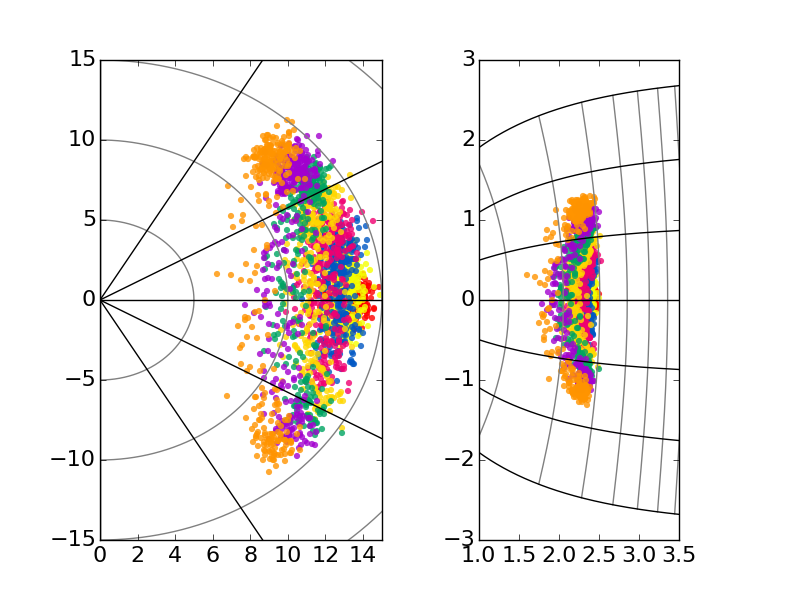
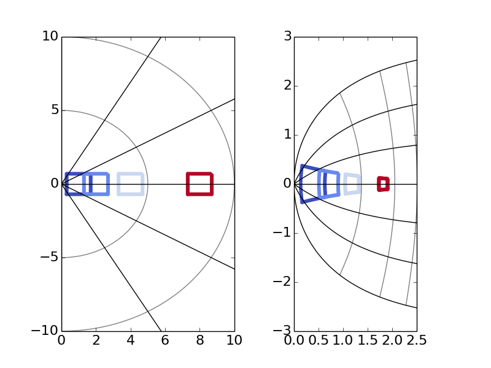
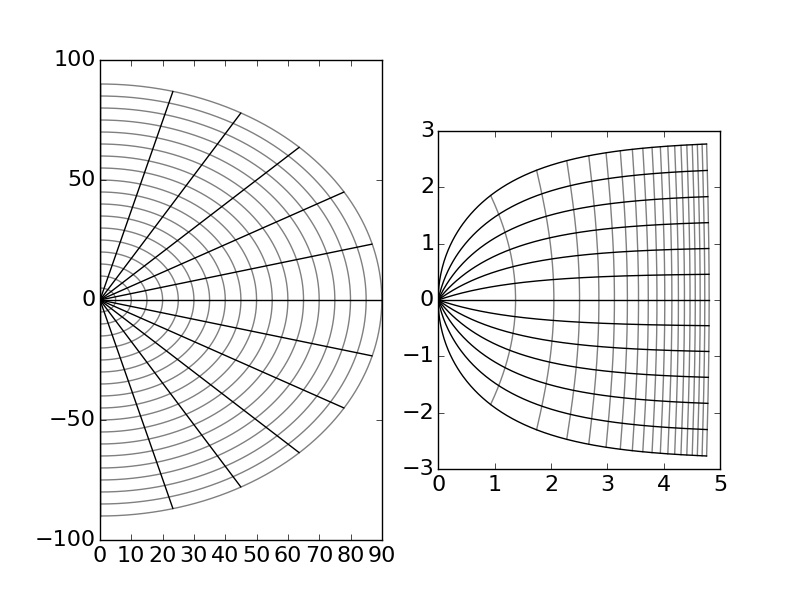
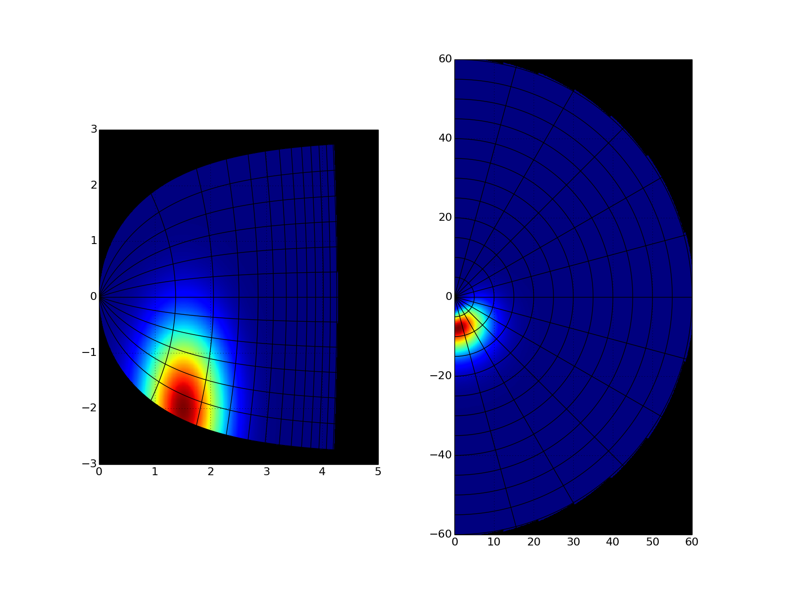
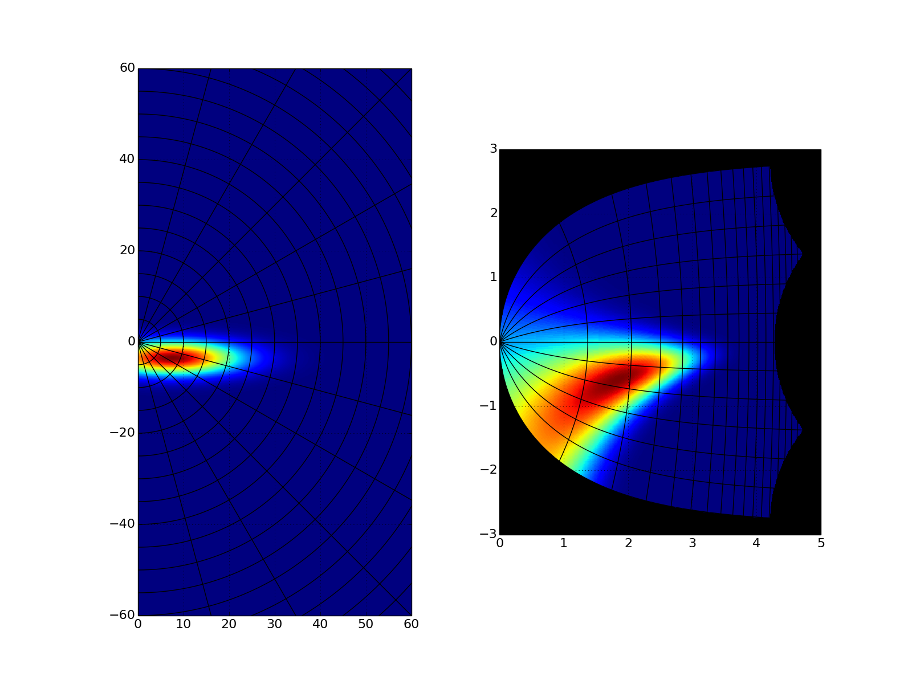
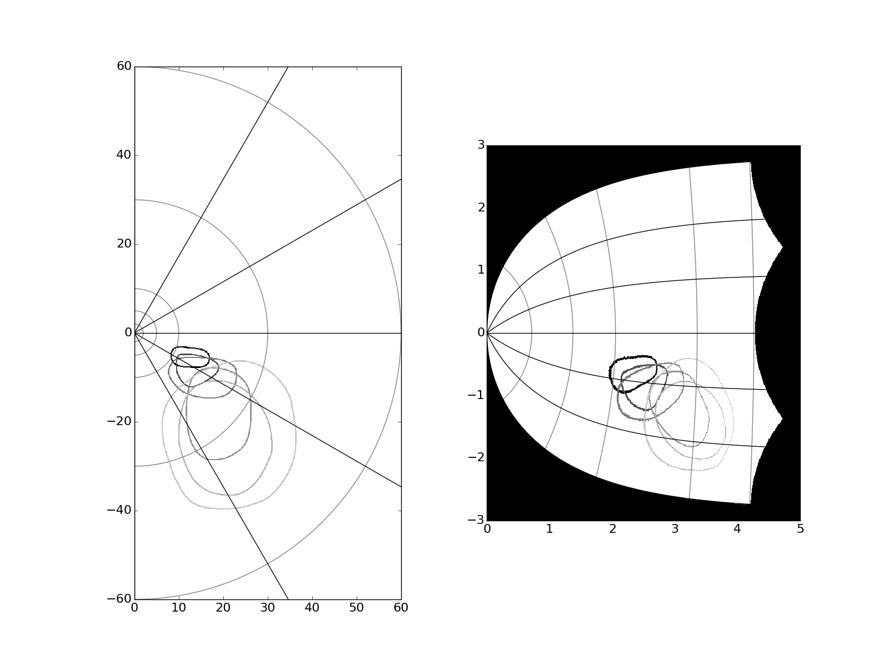

## What's the library for:

This library allows to project stimulus, data points or pictures from visual space to the Superior Colliculus space -- and the other way round.
The Superior Colliculus is a structure involved in visual perception and in occolumotor movements.

The equations used to project from one space to another are from the article of Ottes et al. (1986) you can find [HERE](http://www.mbfys.ru.nl/staff/j.vangisbergen/endnote/endnotepdfs/artikelen_groep/Ottes%201986.pdf).

- The library tools are contains in util/SCTransformation.py,
- The files in the main folder are examples to use the library,
- The folder img contains the output of the examples.

## Examples:
- Project the landing positions of human participant from visual space to SC space:

- Project Stimuli used in Boch et al. 1984 from visual space to SC space:

- Create grids of the SC space for publication: 

- Project a 2D activity matrix/map from SC to visual space:

- Project a 2D activity matrix/map from visual to SC space:

- Project actual picture from visual space to SC space:

## To run the example programs:

*I recommend to install a distribution of python which already contains everything relevant for science as Anaconda, WinPython or python(x,y).*

If you don't want to install one of those distribution, you'll need **python 2.7** installed with the following libraries:
- Matplotlib
- Numpy
- PIL (for running TransformFromPicture.py)

You get three different ways to run the examples:
- opening and running the file through the IDE provided by the python distribution you chose,
- by double-cliking on the file (note that the program will just stop and disappear if an error occur),
- SHIFT + right-clik in the folder, select "open command window here", write "PlotSCGrid.py" to run the corresponding file (this way the program does not disappear if an error occurs).

## If you don't know how to view and edit the example programs:

The distribution mentionned above (Anaconda, WinPython, python(x,y)) will provide you with an editor/IDE which can view, edit and run python files.

The Windows' notepad will also allow you to open and edit .py files.
A software like Notepad++ will be better a better job than the notepad for writing/editing little programs in python.

For bigger programs, several IDEs for python exist as Spyder, IEP, Pycharm or PyScripter.
